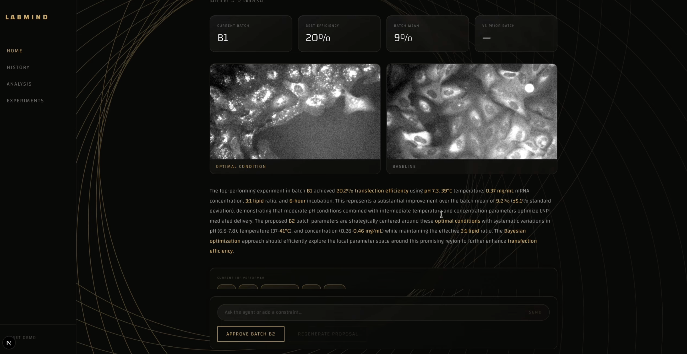

# LabMind

**Live Agent:** https://lab-mind.vercel.app/

**Demo Video:** https://youtu.be/_BhIjSgo9Jo 



An AI agent dashboard for autonomous scientific experiment optimization. LabMind demonstrates a human-in-the-loop workflow where an AI proposes the next batch of laboratory experiments, researchers review and optionally adjust the proposal, and then approve it — creating a continuous optimization loop.

**Research domain:** mRNA-LNP (lipid nanoparticle) delivery optimization — finding the optimal combination of pH, temperature, mRNA concentration, lipid ratio, and incubation time to maximize transfection efficiency.

---

## What This Agent Does

LabMind runs a LangChain ReAct agent backed by Claude that autonomously:

1. Processes fluorescence microscopy TIF images (BBBC016 dataset) to measure transfection efficiency per experiment using computer vision (Otsu thresholding + watershed segmentation)
2. Identifies the top-performing parameter combination across a 20-experiment batch
3. Generates 20 optimized parameter candidates for the next batch using Bayesian optimization (Latin Hypercube Sampling centered on the top performer)
4. Produces a scientific analysis of the batch results in natural language
5. Accepts researcher constraints via chat (e.g. "exclude concentrations above 0.3 mg/mL") and regenerates a compliant proposal

The agent is designed for physical laboratory settings where each batch takes hours to days to complete. All experiments in a batch run in parallel, not serially. The researcher is always in the loop — the agent proposes, the researcher reviews and approves.

**Where to use it:** As a demo or starting point for any lab automation workflow that needs human-in-the-loop AI optimization — drug formulation, cell culture condition screening, process parameter optimization, or any domain where experiments run in parallel batches and convergence toward an optimum is the goal.

---

## Tech Stack

| Layer | Technology |
|---|---|
| Frontend | Next.js 15 + TypeScript + Tailwind CSS + Recharts |
| Backend | Python 3.11 + FastAPI + LangChain |
| LLM | Claude API (`claude-sonnet-4-20250514`) via Anthropic SDK |
| Agent framework | LangChain ReAct agent with `AgentExecutor` + `ConversationBufferMemory` |
| Optimization | Latin Hypercube Sampling (`scipy.stats.qmc`) |
| Image processing | `tifffile`, `scikit-image` (Otsu threshold, watershed), `Pillow` |
| Data store | JSON files (no database) |
| Deployment | Frontend → Vercel, Backend → Railway |
| Image dataset | BBBC016 (Broad Institute) — GFP fluorescence TIF files |

---

## How to Run Locally

You need two terminals — one for the backend, one for the frontend.

### Prerequisites

- Python 3.11
- Node.js 18+
- An Anthropic API key

### Backend

```bash
cd backend
python -m venv .venv && source .venv/bin/activate
pip install -r requirements.txt
cp .env.example .env
# Edit .env and set ANTHROPIC_API_KEY=sk-ant-...
uvicorn main:app --reload --port 8000
```

The backend starts at `http://localhost:8000`. On first startup it resets any in-flight state to IDLE and clears processed image PNGs (they are regenerated on each run).

### Frontend

```bash
cd frontend
npm install
cp .env.local.example .env.local
# .env.local.example already points to localhost:8000 — no changes needed
npm run dev
```

The frontend starts at `http://localhost:3000`.

### Verify

Open `http://localhost:3000` — you should see the Welcome page. The History page should show pre-seeded batches B1 and B2.

---


## User Workflow

The system moves through a state machine. The frontend polls `GET /api/status` every 4 seconds to reflect live state changes.

```
IDLE → RUNNING → COMPLETE → PROCESSING → ANALYZING → PROPOSAL_READY → APPROVED → RUNNING → ...
```

**Optional editing branch:**
```
PROPOSAL_READY → EDITING → REGENERATING → PROPOSAL_READY → APPROVED
```


## Project Structure

```
LabMind/
├── backend/
│   ├── main.py               # FastAPI app, all endpoints, CORS, background tasks
│   ├── agent.py              # LangChain ReAct agent, tool loop, chat
│   ├── tools.py              # 4 LangChain tools (load, rank, optimize, images)
│   ├── image_processing.py   # TIF reading, Otsu threshold, transfection rate computation
│   ├── state_manager.py      # state.json read/write with thread locking
│   ├── models.py             # Pydantic request/response models
│   ├── requirements.txt
│   ├── data/
│   │   ├── state.json        # global state machine state
│   │   ├── batches/          # batch_B1.json, batch_B2.json (pre-seeded), batch_B3+.json (generated)
│   │   └── proposals/        # pending.json (agent-generated, overwritten on regenerate)
│   └── static/images/        # BBBC016 TIF files + processed/ GFP PNGs (runtime-generated)
│
└── frontend/
    └── src/
        ├── app/              # Next.js routes: /, /history, /experiments, /analysis
        ├── components/       # WelcomePage, RunningView, AgentAnalysis, Sidebar, charts, etc.
        ├── hooks/            # usePolling (4s), useChat
        └── lib/              # api.ts (typed fetch client), types.ts
```

---

## API Endpoints

| Method | Endpoint | Description |
|---|---|---|
| `GET` | `/health` | Health check — used by Railway |
| `GET` | `/api/status` | Current state, batch ID, analysis text, chat history, image URLs. Polled every 4s. |
| `GET` | `/api/batch/{id}` | Full batch data — all 20 experiments with parameters and results |
| `GET` | `/api/batches` | All batch summaries for the history page |
| `POST` | `/api/simulate` | Triggers the full agent loop as a background task |
| `POST` | `/api/chat` | Send a message to the agent; detects constraints and transitions to EDITING |
| `POST` | `/api/approve` | Commits pending proposal as next batch JSON, resets to RUNNING |
| `POST` | `/api/regenerate` | Regenerates proposal with current constraint |
| `POST` | `/api/reset` | Resets demo: state → IDLE, deletes B3+ batches, keeps B1 and B2 |

---

## References

- [BBBC016 Dataset](https://bbbc.broadinstitute.org/BBBC016) — Broad Bioimage Benchmark Collection, human U2OS cells, GFP transfection assay
- [Lila Sciences](https://lilasciences.com) — visual design reference and inspiration for the AI lab automation concept
- [Claude API](https://docs.anthropic.com) — Anthropic's API documentation
- [LangChain ReAct agents](https://python.langchain.com/docs/modules/agents/agent_types/react) — agent framework documentation
- [Latin Hypercube Sampling (scipy.stats.qmc)](https://docs.scipy.org/doc/scipy/reference/generated/scipy.stats.qmc.LatinHypercube.html) — Bayesian optimization sampling method
- [FastAPI](https://fastapi.tiangolo.com) — Python backend framework
- [Next.js](https://nextjs.org/docs) — React frontend framework
- [Railway](https://railway.app) — backend deployment platform
- [Vercel](https://vercel.com) — frontend deployment platform
